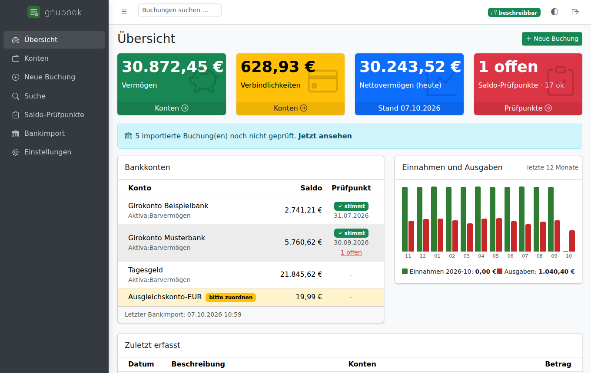
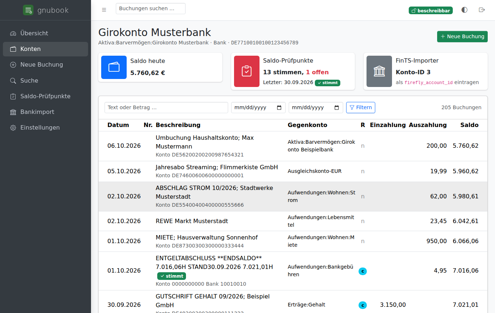
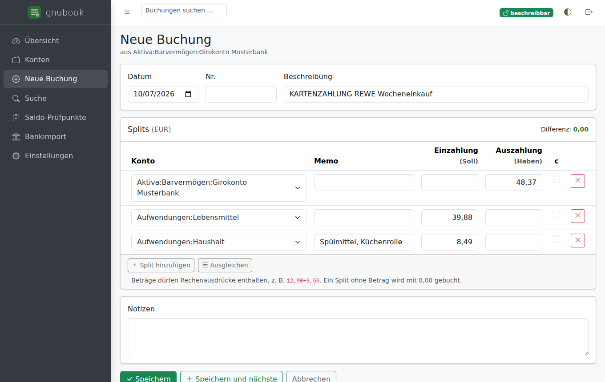
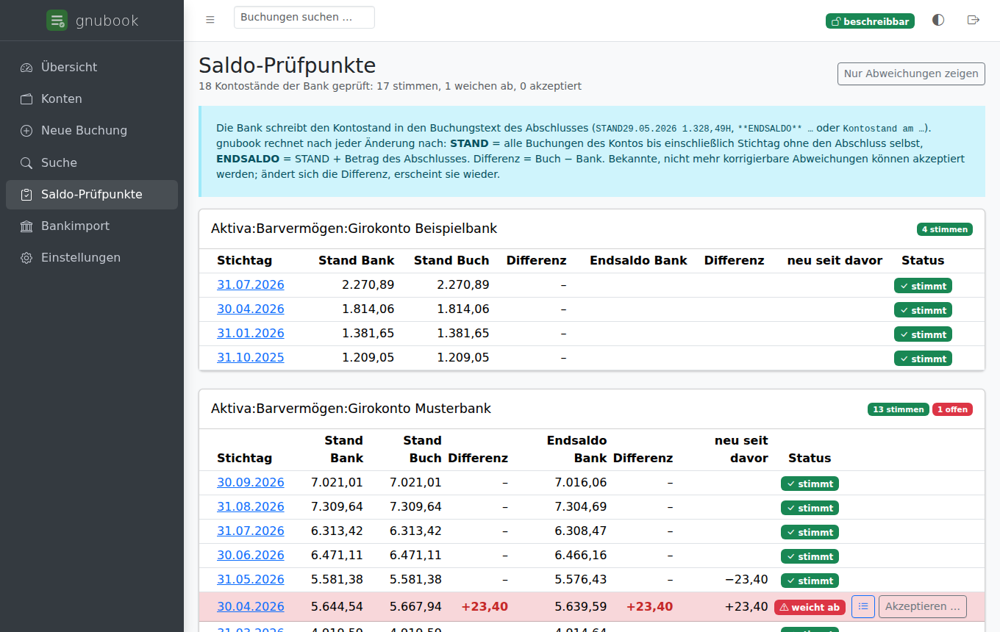
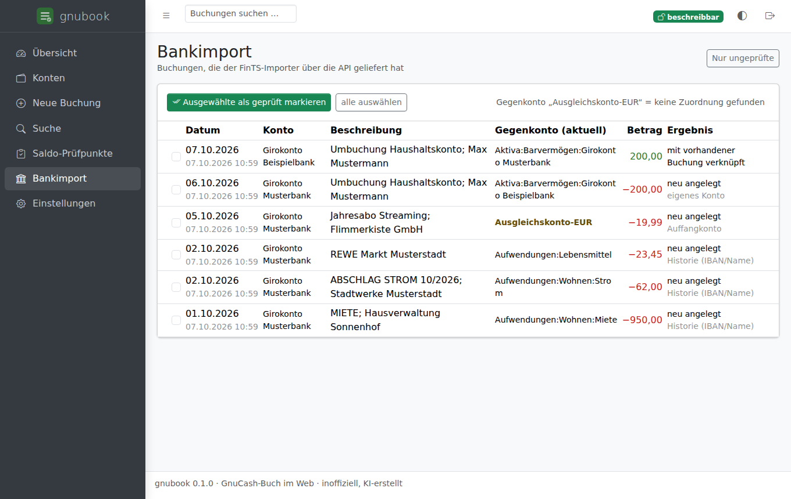

# gnubook

> [!WARNING]
> **Unofficial project, written by an AI.** gnubook was created by an AI assistant (Claude by Anthropic)
> on behalf of its maintainer. It is not affiliated with GnuCash, Firefly III or piecash.
> gnubook **writes into your GnuCash book**. Keep backups, try it on a copy first, and use it at your own risk.

gnubook is a small self-hosted web frontend for a [GnuCash](https://www.gnucash.org/) book stored in
PostgreSQL (or SQLite). It looks and feels a bit like [Firefly III](https://www.firefly-iii.org/), but the
data remains an ordinary GnuCash book. GnuCash Desktop can open the same database whenever gnubook is not
writing to it.

The user interface is available in German and English (switch per user). Amounts and dates keep the
German format in both languages.



<sub>All screenshots show the synthetic demo book (`gnubook demo-book`). Names and numbers are made up.</sub>

## Features

- **Dashboard.** It shows net worth, bank accounts with the status of their balance checkpoints, income and
  expenses for the last 12 months, and recently entered bookings.
- **Income and expenses report** (inspired by [GnuDash](https://github.com/QuirkyTurtle94/GnuDash)), read-only:
  - Sankey flow from income categories to expense categories, with savings or shortfall;
  - category breakdown as donut chart and table (share, average per month), with drill-down into
    sub-categories and registers;
  - monthly trend bars and table, also for a single category;
  - budget vs. actual for GnuCash budgets, with variance, progress bars and spending without a budget;
  - periods (this/last month, this/last year, last 12 months, custom), 1–3 category levels, book-closing
    transactions left out unless switched on.
- **Accounts and registers.** The account tree shows balances in GnuCash's sign convention. Each account has
  a register with running balance, text, amount and date filters, and paging. Placeholder accounts can be
  shown with their sub-accounts.
- **Transactions with free splits:**
  - Any number of accounts per transaction. 0,00 splits are allowed.
  - Amounts are entered the German way, and simple arithmetic works (`12,90+3,50`).
  - Descriptions are suggested as you type, and a known description fills in its splits like GnuCash's
    quick-fill.
  - Bookings can be edited, copied and deleted.
- **Bank balance checkpoints.** Banks write the statement balance into the closing line
  (`ENTGELTABSCHLUSS **ENDSALDO** 1.234,56H STAND29.05.2026 1.239,51H`, `… Kontostand am 31.03.2026 47,11 +`).
  - gnubook recomputes every checkpoint after each change and warns when one breaks.
  - It shows in which period a difference appeared.
  - Known differences can be accepted. If an accepted difference changes, it is reported again.
  - `gnubook check-balances` does the same check for cron. See [docs/CHECKPOINTS.md](docs/CHECKPOINTS.md).
- **Bank import** with [bnw/firefly-iii-fints-importer](https://github.com/bnw/firefly-iii-fints-importer).
  gnubook implements the part of the Firefly III API that the importer uses. See [docs/FINTS.md](docs/FINTS.md).
  - **Duplicates.** Exact re-imports are rejected. Bank lines that are already in the book (for example
    imported earlier by GnuCash itself) are linked instead of booked twice.
  - **Own accounts.** Transfers between your own accounts are booked once, even though both banks report
    them.
  - **Counter account.** It comes from your own accounts (IBAN), the book's history for the counterparty,
    GnuCash's Bayesian import map, or a fallback account, in this order.
  - **Zero amounts.** 0,00 closing lines become single-split bookings, so their balance can be checked.
  - **Review.** A page lists new imports and possible duplicates for checking.
- **Safety:**
  - gnubook never writes while GnuCash Desktop has the book open (table `gnclock`), and it holds the lock
    itself while writing.
  - Changes made elsewhere in the meantime are detected before saving.
  - Unknown GnuCash database versions are only read, never written.
  - Every change is logged in an audit log.
  - Optionally, after every change a copy of the whole book is written as a `.gnucash` file (SQLite format,
    opens directly in GnuCash Desktop), with rotation of older versions.
- **Backups as `.gnucash` file.** A nightly timer saves the whole book as a SQLite GnuCash file that GnuCash
  Desktop opens directly (`gnubook backup`).
- **Optional copy into your own Nextcloud.** Each user connects either a password-protected share link of one
  folder (recommended: gnubook can only write into that folder) or the whole account (login flow / app
  password), and chooses a folder and file name per book under *Einstellungen*. After every change gnubook
  uploads the `.gnucash` file via WebDAV; Nextcloud's versions app keeps the older states. Stored passwords
  are encrypted with a key from `config.toml` (not stored in `data/`); the running server can still read them,
  since it uploads in the background.
- **Several users and books.** Every user logs in with their own password. Every book is its own GnuCash
  database. Books can be shared, and a user with several books switches between them in the header.
  Administrators manage users and books in the web UI.
- **New books with their own database.** With `[postgres] admin_url` gnubook creates a PostgreSQL role and
  database for each new book, filled empty, with a simple German chart of accounts, or from an uploaded
  GnuCash SQLite file. The credentials for GnuCash Desktop are shown once. Deleting such a book can also drop
  its database and role (after confirming the name and writing a last `.gnucash` copy). See
  [docs/INSTALL.md](docs/INSTALL.md).
- **Bank profiles.** Everything country- or bank-specific lives in `gnubook/banks/` and is chosen per book:
  - balance-line formats;
  - the booking text of imports;
  - recognising own accounts by IBAN.

  The German profile is the default. A generic profile and your own balance-line patterns
  (`[[checkpoints.patterns]]`) cover other banks. Profile and import settings can be set per book under
  *Bücher → Bankprofil und Import*; they override `[import]`.
- German and English user interface, chosen in the user menu or on the login page.
- Dark mode and a layout that works on phones.

| Register | Transaction with splits |
|---|---|
|  |  |
| **Balance checkpoints** | **Bank import review** |
|  |  |

## How it works

- **Reading** is plain SQL on the GnuCash tables. The day of a booking is GnuCash's `post_date` in the
  configured time zone, so it matches what GnuCash Desktop shows.
- **Writing** goes through [piecash](https://github.com/sdementen/piecash). gnubook validates every booking
  first:
  - the booking is balanced and uses one currency;
  - no placeholder accounts are used;
  - reconciled splits stay unchanged;
  - nobody changed the booking in the meantime.

  New bookings get GnuCash's conventions (`post_date` 10:59 UTC, `date-posted` slot, notes slot).
- **Locking.** For every write gnubook checks `gnclock`, inserts its own lock row, writes, and removes the
  row again. While GnuCash Desktop has the book open, gnubook is read-only.
- **gnubook's own data** lives in a small SQLite database under `data_dir`. It holds numeric API ids, import
  records, accepted checkpoint differences and the audit log. Nothing extra is stored in the GnuCash book.

## Requirements

- A GnuCash book in an SQL database, created by GnuCash 3.0 or newer (tested with 5.5). PostgreSQL is
  recommended; SQLite works too. MySQL has not been tested.
- Python 3.11 or newer, for example Debian 12/13 or Ubuntu 22.04+.

## Try it with the demo book

```bash
git clone https://github.com/Simon0Harms/gnubook.git && cd gnubook
python3 -m venv .venv && . .venv/bin/activate
pip install -e .
gnubook demo-book /tmp/demo.gnucash
gnubook init-config config.toml --data-dir ./data
export GNUBOOK_CONFIG=$PWD/config.toml
gnubook user-add demo --admin
gnubook book-add Demo sqlite:////tmp/demo.gnucash --user demo
gnubook serve                  # http://127.0.0.1:8080
```

## Installation

For a Proxmox LXC with the book in a separate PostgreSQL LXC, see **[docs/INSTALL.md](docs/INSTALL.md)**.
In short:

```bash
# in a Debian 12/13 LXC, as root
apt-get install -y curl
curl -fsSL https://raw.githubusercontent.com/Simon0Harms/gnubook/main/deploy/install.sh \
  | GNUBOOK_REPO=https://github.com/Simon0Harms/gnubook.git bash
```

Everything lives under `/opt/gnubook`: code, virtualenv, `config.toml`, `data/` and `backup/`. gnubook runs
as the systemd service `gnubook` (gunicorn, port 8080). Create the first admin with `gnubook user-add NAME
--admin`, then connect books in the web UI. Run `gnubook-update` to update.

## Configuration

`/opt/gnubook/config.toml` (TOML). Users and books are not part of the file; they are managed in the web UI
or on the command line. Every value can be overridden with an environment variable
`GNUBOOK_<SECTION>_<KEY>`, for example `GNUBOOK_BOOK_URL`.

| Key | Meaning |
|---|---|
| `[app] secret_key` | Random string, at least 32 characters (`init-config` creates one) |
| `[app] data_dir` | gnubook's own data: users, books, tokens (`system.sqlite`) and per-book data |
| `[app] language` | Default UI language for users without their own choice: `de` (default) or `en` |
| `[app] session_cookie_secure`, `behind_proxy` | Set both to `true` behind an HTTPS reverse proxy |
| `[api] expose_iban` | Report IBANs to the importer (default `false`, see [docs/FINTS.md](docs/FINTS.md)) |
| `[import] fallback_account` | Account for bank lines without a known counter account (default `Ausgleichskonto-EUR`/`Imbalance-EUR`) |
| `[import] accounts` | Only these accounts are offered to the importer (default: all bank, asset, cash and credit accounts) |
| `[import] iban_map` | IBAN → account, for own accounts gnubook cannot find by account code or GnuCash online-banking data |
| `[import] transit_account`, `transit_between` | Book transfers between the listed accounts through a transit account |
| `[import] match_days`, `transfer_match_days` | Window for linking bank lines to existing bookings (3 / 7 days) |
| `[backup] keep` | Versions of the per-book `.gnucash` copy to keep (the file itself is set per book under *Bücher*) |
| `[nextcloud] enabled` | Let users upload the `.gnucash` copy into their own Nextcloud (default `true`) |
| `[nextcloud] allow_http` | Also accept `http://` Nextcloud addresses (default `false`) |
| `[nextcloud] encryption_key` | Key for the stored Nextcloud passwords; empty = derived from `[app] secret_key`. Changing it means users connect again |
| `[postgres] admin_url` | Role with `CREATEROLE` and `CREATEDB` (no superuser) that lets gnubook create a database per new book |
| `[[checkpoints.patterns]]` | Own balance-line patterns (`stand` regex, `keyword`), used with every bank profile |

The `[import]` values are defaults. Each book can override them under *Bücher → Bankprofil und Import*.

## Command line

| Command | Purpose |
|---|---|
| `gnubook check` | Check the configuration, the database connection, the GnuCash version and the lock |
| `gnubook user-add NAME [--admin] [--book B]`, `user-list`, `user-password NAME` | Manage users (also in the web UI) |
| `gnubook book-add NAME URL [--user U]`, `book-list` | Connect existing GnuCash databases as books (also in the web UI) |
| `gnubook book-create NAME [--content simple\|empty\|file] [--file F] [--user U]` | Create a new PostgreSQL database and book (needs `[postgres] admin_url`) |
| `gnubook token-create USER --book B` | API token for the FinTS importer (also under *Einstellungen*) |
| `gnubook check-balances [--book B] [--account NAME] [--show-all] [--accept-open]` | Recompute all balance checkpoints. Exit code 1 means open differences |
| `gnubook backup [--book B] [--dir DIR] [--keep N]` | Save the book now as a `.gnucash` file (SQLite) that GnuCash Desktop opens |
| `gnubook demo-book PATH` | Create the synthetic demo book |
| `gnubook init-config PATH` | Create a configuration file with a random `secret_key` |
| `gnubook serve` | Development server. In production use gunicorn, see `deploy/` |

## Working alongside GnuCash Desktop

- gnubook writes only while GnuCash Desktop has the book closed. The header shows *„GnuCash Desktop geöffnet
  – nur lesen“* while it is open. Imports sent during that time are rejected with a message, so run the
  importer again later.
- GnuCash Desktop loads the whole book when it opens. Bookings gnubook made appear the next time you open
  the book in GnuCash.
- If GnuCash crashes, its lock row may stay behind. *Einstellungen* shows it and can remove it.

## Limitations

- Bookings that involve other currencies, securities, lots or GnuCash's business features are shown, but
  they can only be changed in GnuCash Desktop.
- Apart from the income and expenses report there are no reports. Budgets are only shown, not edited. There are
  no scheduled transactions or reconciliation workflow. Use GnuCash Desktop for those.
- The import API covers what bnw/firefly-iii-fints-importer needs, not all of Firefly III's API.

## Development

```bash
pip install -e ".[dev]"
pytest                                    # SQLite
GNUBOOK_TEST_PG_URL=postgresql://user:pw@127.0.0.1:5432 pytest    # also PostgreSQL (user needs CREATEDB)
GNUCASH_PYTHON=/usr/bin/python3 pytest tests/test_gnucash_compat.py  # read back with the real GnuCash engine (apt install python3-gnucash)
```

Every UI text needs an English translation in `gnubook/translations_en.py`; `tests/test_i18n.py` fails
otherwise.

`scripts/screenshots.mjs` regenerates the screenshots from the demo book. Never use real data for
screenshots.

## License

GPL-3.0-or-later, see [LICENSE](LICENSE). Bundled front-end libraries:

- [AdminLTE](https://adminlte.io/) (MIT)
- [Bootstrap](https://getbootstrap.com/) (MIT)
- [Bootstrap Icons](https://icons.getbootstrap.com/) (MIT)
- [Tom Select](https://tom-select.js.org/) (Apache-2.0)

Their license files are in `gnubook/static/vendor/`.
